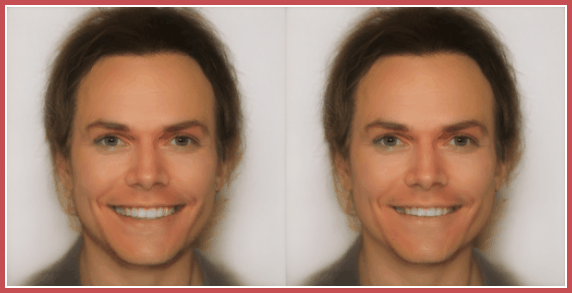
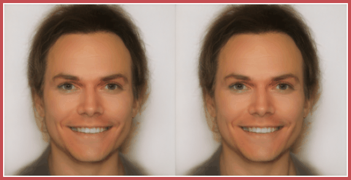
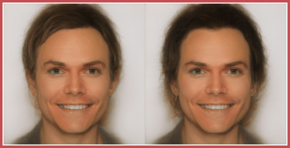

# gen_unc_sample
# Results on real images
* We demonstrate the results of our approach for real images sampled from the Celeb-A dataset.
*  `Green box` around the image represents calibrated intervals. 
*  `Red box` around the image represents uncalibrated intervals.

<b> Example 1: This image is illustrated in the main manuscript in Figure 4. </b>

<blockquote>
  

Easy / hard results

  <blockquote>
    
|                  |            | 
| ---              |     ---    |  
| Easy  |  
| Hard  |  
    
  </blockquote>
  

  

Uncertainty intervals per semantic factor

  <blockquote>
  

Smile

  <blockquote>
    
|      Easy            |       Hard     | 
| ---              |     ---    |  
| | 
    
  </blockquote>
  

  

Glasses

  <blockquote>
    
|      Easy            |       Hard     | 
| ---              |     ---    |  
| | 
    
  </blockquote>
  

  

Hair

  <blockquote>
    
|      Easy            |       Hard     | 
| ---              |     ---    |  
| | 
    
  </blockquote>
  

    
  </blockquote>
  

</blockquote>

<b> Example 2 </b>

<blockquote>
  

Easy / hard results

  <blockquote>
    
|                  |            | 
| ---              |     ---    |  
| Easy  |  
| Hard  |  
    
  </blockquote>
  

  

Uncertainty intervals per semantic factor

  <blockquote>
  

Smile

  <blockquote>
    
|      Easy            |       Hard     | 
| ---              |     ---    |  
| | 
    
  </blockquote>
  

  

Glasses

  <blockquote>
    
|      Easy            |       Hard     | 
| ---              |     ---    |  
| | 
    
  </blockquote>
  

  

Hair

  <blockquote>
    
|      Easy            |       Hard     | 
| ---              |     ---    |  
| | 
    
  </blockquote>
  

    
  </blockquote>
  

</blockquote>

